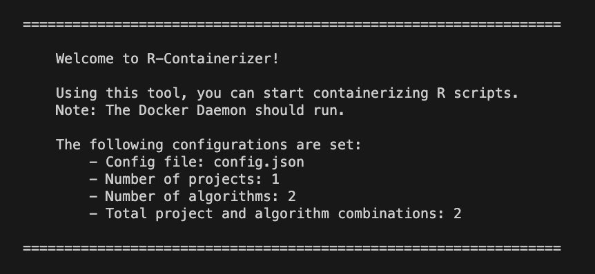
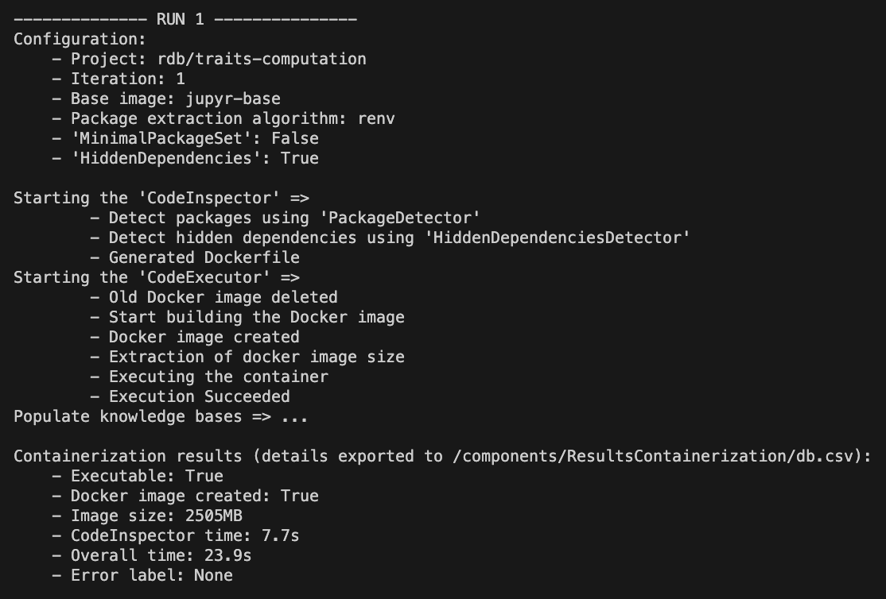

# Documentation 'R-Containerizer'
- Author: Diederik Blanson Henkemans
- Master Thesis Software Engineering
- University: Universiteit van Amsterdam (UvA)
- Year: 2023

---
Welcome to 'R-Containerizer'! This tool is designed to facilitate the containerization of R scripts, providing a streamlined process for packaging and running R projects. This documentation will guide you through the installation process and explain how to use 'R-Containerizer' to containerize your projects. 

## Installation
Before using 'R-Containerizer', it is important to install the required components. The process consists of setting up Docker, Python, and R.

### Docker
1. Install Docker and run the Docker Daemon.
2. Create the Docker images by executing: `sh standalone-images/create-images.sh`

### Python
1. Install `python3`.
2. Install python packages using `pip install -r requirements-python.txt`.

### R
1. Install `R`.
2. Install R packages using `sh requirements-r.sh`.

## Running 'R-Containerizer'
To start containerizing an R script, perform the following steps:

### 1. Upload an R project 
This can be done by creating a folder in `rdb` with the name of the project. Although one can give all types of assets, such as data sets and R scripts, it is important that the R script to be containerized is called `myScript.R`

### 2. Create a configuration file
In order to containerize the project, one should give the correct configurations in the `config.json` file (see example config.json). This consists of the following properties:
- `projects`: this is a list of projects to be containerized where one should specifiy the `source_folder` and `docker_image_name`. Input parameters are optional and can be specified by the property name `inputs` in the following format:
`
[{
    "name": <VARIABLE_NAME>,
    "type": <VARIABLE_TYPE>,
    "default": <VARIABLE_DEFAULT_VALUE>
}]
` 
- `algorithms`: here one can specifiy the configuration for the containerization. This includes the following properties:
    1. `base_image`: This is the Docker image
    2. `package_extraction`: This is the type of approach to use for the package extraction. This can be done with 'naive' (RegEx approach) or 'renv' (R package renv::dependencies).
    3. `dependency_installation`: The type of installation for dependencies, e.g., using binary/source formats, and which types of repositories to support.
    4. `ms-base-image`: Check if package is in the base image, if this is the case, dont install the package.
    5. `minimal-set`: Enabling the MinimalPackageSet component.
    6. `advanced-dependencies`: Enabling the HiddenDependencies component.

### 3. Execute the script
The tool can be started with the command `python3 R-Containerizer.py config.json`. First, a welcome message will be shown:
 

In the example `config.json`, two runs will be performed (1 project * 2 algorithms). A run will look as follows:
 

First, the configuration is displayed. Next, the CodeInspector is executed which is followed by the CodeExecutor. Finally, the results will be exported to the file `components/ResultsContainerization/db.csv`, where previous results are archived in `/final-data/results.csv`.

## Existing tools
The analysis of several existing containerization tools for R can be found in the folder `/tools`.

## Components
All the components that we have implemented can be found in the folder `/components`.
